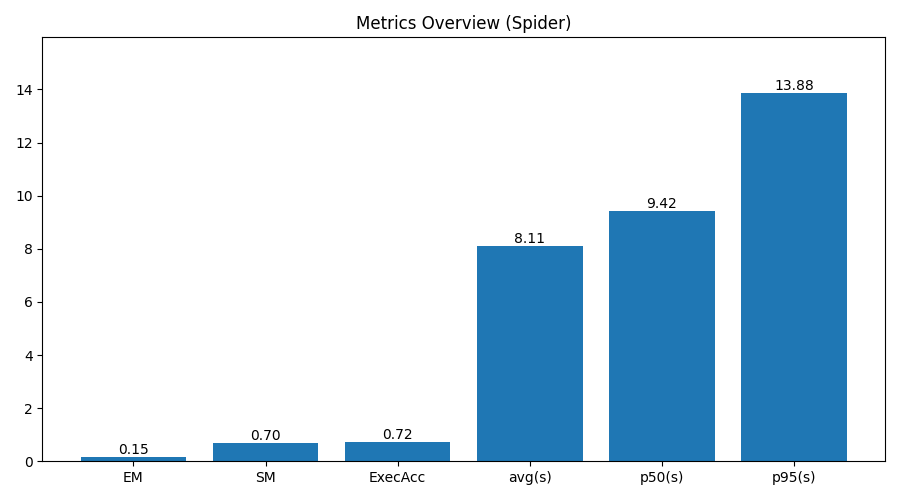

# 🧩 NL2SQL Copilot

[](https://github.com/melika-kheirieh/nl2sql-copilot/actions/workflows/ci.yml)
[](#)
[](LICENSE)

A production-grade **Text-to-SQL Copilot** that converts natural-language questions into **safe, verified SQL**.
Built for analytics engineers who need accuracy, transparency, and control — powered by **FastAPI**, **LangGraph**, and **Pydantic-AI**.

---

## 🚀 Overview

`NL2SQL Copilot` is an **agentic, modular pipeline** that plans, generates, verifies, and repairs SQL queries.
It ensures correctness and safety through structured stages, evaluation on the **Spider** dataset, and full observability support.

> 💡 Designed for **read-only production databases** with **self-repair**, **metrics**, and **CI/CD** baked in.

---

## 🧠 Agentic Architecture

```

Natural Language
↓
[ Detector ]
↓
[ Planner ]
↓
[ Generator (LLM) ]
↓
[ Safety ]
↓
[ Executor ]
↓
[ Verifier ]
↓
[ Repair ]

````

Each stage is isolated, configurable via YAML, and observable through structured traces and Prometheus metrics.

| Stage | Responsibility |
|--------|----------------|
| **Detector** | Identify whether a query is Text-to-SQL |
| **Planner** | Extract user intent and SQL plan |
| **Generator** | Call LLM to synthesize SQL |
| **Safety** | Block unsafe or non-SELECT queries |
| **Executor** | Execute query in read-only sandbox |
| **Verifier** | Compare results, detect mismatch |
| **Repair** | Self-healing loop triggered on failure |

---

## 📊 Benchmark (Spider dataset)

Dataset: [Spider](https://yale-lily.github.io/spider) by Yale LILY Lab.
Evaluated on the **Spider dev subset (20 samples)** using the reproducible evaluation toolkit.

| Metric | Value |
|--------|--------|
| EM (Exact Match) | 0.15 |
| SM (Structural Match) | 0.70 |
| ExecAcc (Execution Accuracy) | 0.73 |
| Avg Latency | 8.11 s |
| p50 Latency | 9.42 s |
| p95 Latency | 13.88 s |

> High **Structural Match** and **Execution Accuracy** indicate strong semantic correctness;
> lower EM reflects harmless formatting differences.

Run reproducible benchmarks:

```bash
export SPIDER_ROOT="$PWD/data/spider"
PYTHONPATH=$PWD python benchmarks/evaluate_spider_pro.py --spider --split dev --limit 20
PYTHONPATH=$PWD python benchmarks/plot_results.py
````

Results & plots → `benchmarks/results_pro/20251109-171247/`



---

## ⚙️ Key Features

✅ **Agentic architecture** – multi-stage pipeline with feedback loop

🛡️ **Safety layer** – SELECT-only guardrails and AST validation

🔁 **Self-repair** – automatic retry when verification fails

📊 **Reproducible evaluation** – integrated Spider / Dr.Spider benchmarking

📦 **Config-driven design** – YAML pipeline factory

🧩 **Plug-and-play adapters** – SQLite / PostgreSQL / OpenAI / Anthropic / Ollama

🧠 **FastAPI service + Streamlit UI** – demo or API mode

🧰 **CI/CD ready** – Makefile, Ruff, Mypy, Pytest, Docker, GitHub Actions

📈 **Observability stack** – Prometheus & Grafana metrics for latency and errors

---

## 🧩 Observability & GenAIOps

Monitor every stage of the pipeline in real-time:

* `/metrics` endpoint exposed via FastAPI
* Prometheus + Grafana stack with `make obs-up`
* Metrics tracked:

  * `nl2sql_stage_latency_ms`
  * `nl2sql_stage_error_total`
  * `nl2sql_query_exec_count`
  * `nl2sql_repair_success_rate`

```bash
make obs-up      # start Prometheus + Grafana
make obs-down    # stop the stack
```

---

## 🧪 Quick Start

### 1️⃣ Clone & Run

```bash
git clone https://github.com/melika-kheirieh/nl2sql-copilot.git
cd nl2sql-copilot
make run
```

Or build with Docker:

```bash
docker build -t nl2sql-copilot .
docker run --rm -p 8000:8000 nl2sql-copilot
```

API available at [http://localhost:8000/docs](http://localhost:8000/docs)
Streamlit demo at [http://localhost:7860](http://localhost:7860)

---

## 🧭 For Developers & CI/CD

```bash
make lint          # Ruff
make typecheck     # Mypy
make test          # Pytest
make bench         # Run benchmark suite
```

### CI/CD Highlights

* Runs on GitHub Actions (`make check`)
* Enforces formatting, typing, tests, and Docker build
* Publishes Docker image to GHCR on successful merge

---

## 🎯 Why it matters

* Bridges **natural language and databases** with measurable reliability
* Provides **reproducible evaluation** for continuous model tracking
* Delivers **production-level resilience** via self-repair and observability
* Demonstrates **AI software engineering** beyond prompt design

---

## 👤 Author

**Melika Kheirieh**
AI Engineer & Researcher in Natural Language Interfaces for Databases
[GitHub](https://github.com/melika-kheirieh) · [LinkedIn](https://www.linkedin.com/in/melika-kheirieh-03a7b5176/)

> This project evolved from [NL2SQL Copilot Prototype](https://github.com/melika-kheirieh/nl2sql-copilot-prototype), refactored into a production-grade, modular agent.

---

## 📄 License

MIT © 2025 Melika Kheirieh
