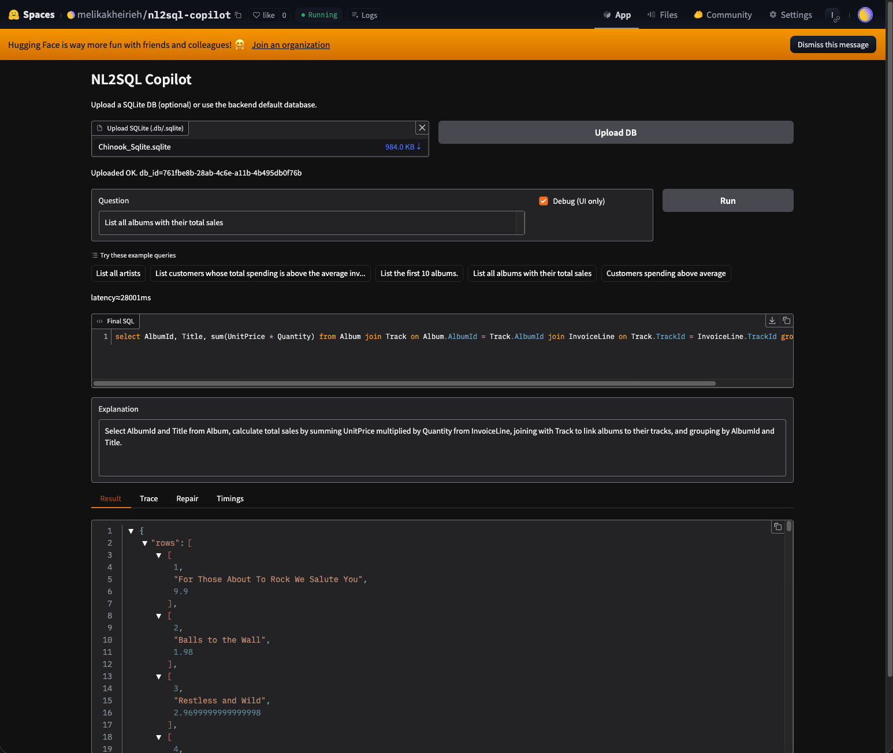
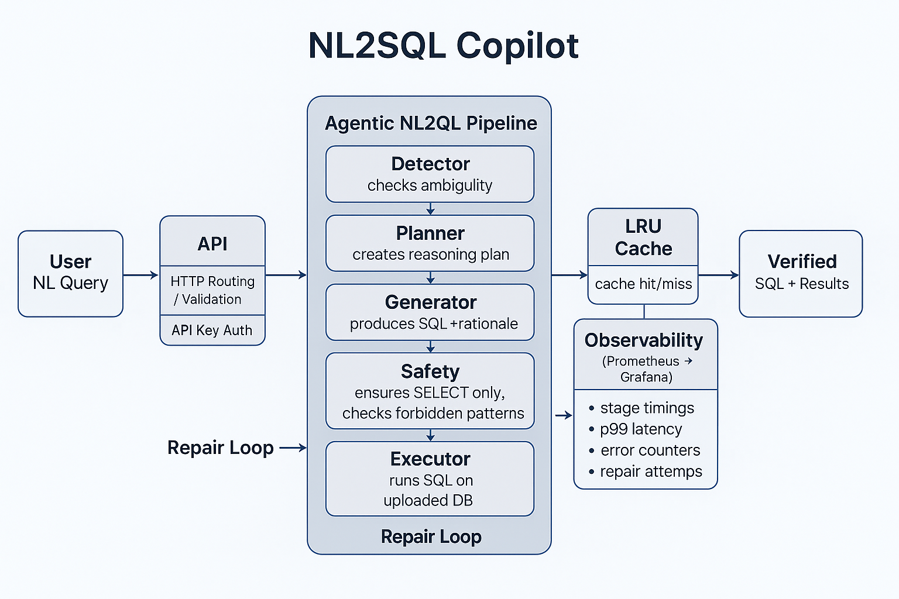
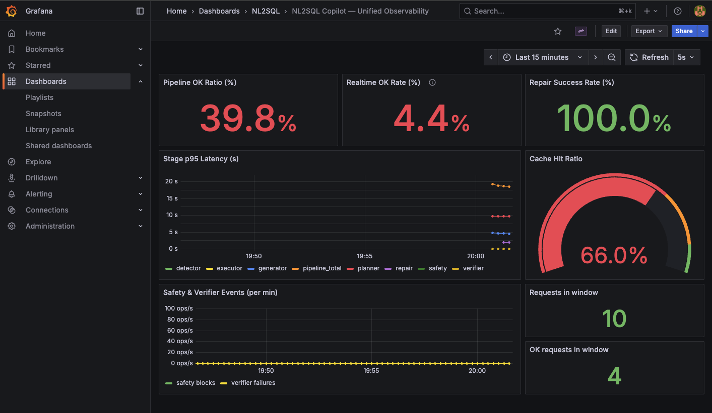
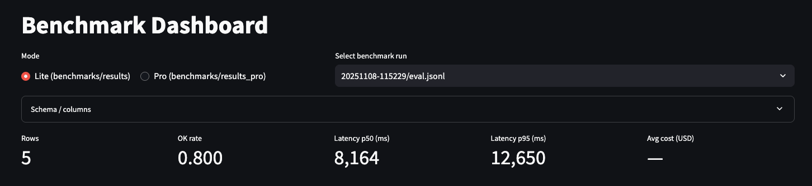

# NL2SQL Copilot — Safety-First, Production-Grade Text-to-SQL

[](https://github.com/melika-kheirieh/nl2sql-copilot/actions/workflows/ci.yml)
[](#)
[](LICENSE)

A **production-oriented, multi-stage Natural Language → SQL system** built around
**explicit safety guarantees, verification, evaluation, and observability** — **not a prompt-only demo**.

This project treats LLMs as **untrusted components** inside a constrained, measurable system,
and operates them through an explicit pipeline with verification and a **bounded repair loop**.

---

## At a glance

* **Agentic NL2SQL pipeline** with explicit planning, verification, and a bounded repair loop
* **Safety-first execution** enforced at the system level (single-statement, SELECT-only)
* **Failure-aware design** with verifier-driven repair and a structured error taxonomy
* **Built-in evaluation**: lightweight smoke runs and Spider-based benchmarks with artifacts
* **Real observability**: Prometheus/Grafana metrics with CI-level drift guards

Reported metrics are **honest engineering baselines**, intended to validate system behavior
and debuggability — not to claim state-of-the-art accuracy.

---

## Why this exists

Most Text-to-SQL demos answer:

> *“Can the model generate SQL?”*

This project answers a harder question:

> **“Can NL→SQL be operated safely as a production system?”**

That means:

* controlling **what the model sees** (deterministic schema packing and context budgeting),
* constraining **what it is allowed to execute** (system-enforced safety, not prompt suggestions),
* verifying results before returning them,
* and continuously measuring **latency, failures, and repair behavior**.

This repository is intentionally scoped to answer that question with
**engineering guarantees** — not model cleverness or prompt tricks.

---

## Demo (End-to-End)

A live interactive demo is available on Hugging Face Spaces:
👉 [**Try the Demo**](https://huggingface.co/spaces/melikakheirieh/nl2sql-copilot)

<p align="center">
  
</p>

---

## Quickstart (Local)

### 1) Install

```bash
make install
```

### 2) Run API (Terminal 1)

```bash
make demo-up
```

### 3) Smoke (Terminal 2)

```bash
make demo-smoke
```

### 4) Observability stack (optional)

```bash
make infra-up
```

Then (optional Prometheus snapshot):

```bash
make demo-metrics
```

---

## What the system does

* Converts natural-language questions into **safe, verified SQL**
* Enforces **SELECT-only execution policies** (no DDL / DML)
* Uses **explicit context engineering** (schema packing + rules)
* Applies **execution and verification guardrails**
* Tracks **per-stage latency, errors, and cost signals**
* Evaluates behavior on **Spider** with a structured error taxonomy
* Exposes **Prometheus metrics** and **Grafana dashboards**

---

## Architecture & Pipeline

<p align="center">
  
</p>

```
Detector
→ Planner
→ Generator
→ Safety Guard
→ Executor
→ Verifier
→ Repair (bounded)
```

The pipeline is designed so that **failures are explicit, classified, and observable** —
not hidden behind retries or prompt heuristics.

Each stage:

* has a single responsibility,
* emits structured traces,
* and is independently testable.

---

## Core design principles

### 1) Context engineering over prompt cleverness

The model never sees the raw database blindly.

Instead, it receives:

* a **deterministic schema pack**,
* explicit constraints (e.g. SELECT-only, LIMIT rules),
* and a bounded context budget.

---

### 2) Safety is enforced, not suggested

Safety policies are **system-level constraints**, not prompt instructions.

Current guarantees:

* Single-statement execution
* `SELECT` / `WITH` only
* No DDL / DML
* Execution time & result guards

Violations are **blocked**, not repaired.

---

### 3) Verification before trust

Queries are executed in a controlled environment and verified for:

* structural validity,
* schema consistency,
* execution correctness.

Errors are surfaced explicitly and classified — not hidden.

---

### 4) Repair for reliability, not illusion

Repair exists to improve **system robustness**, not to chase accuracy at all costs.

* Triggered only for eligible error classes
* Disabled for safety violations
* Strictly bounded (no infinite loops)

---

## Repository structure

```text
app/                 # FastAPI service (routes, schemas, wiring)
nl2sql/              # Core NL→SQL pipeline
adapters/            # Adapter implementations (DBs, LLMs)

benchmarks/          # Evaluation runners & outputs
tests/               # Unit & integration tests

infra/               # Docker Compose + observability stack
configs/             # Runtime configs
scripts/             # Tooling & helpers

demo/                # Demo app
ui/                  # UI surface
docs/                # Docs & screenshots
data/                # Local data & demo DBs
```

---

## Observability & GenAIOps

<p align="center">
  
</p>

Observability in this system is a **first-class design concern**, not an afterthought.
Metrics are used to make **LLM behavior measurable, debuggable, and regressible**
across safety, latency, failures, and repair — both in live runs and during evaluation.

The following signals are tracked to expose **system-level trade-offs**
between accuracy, latency, safety, and cost:

* End-to-end latency (p50 / p95)
* Per-stage latency
* Success / failure counts
* Safety blocks
* Repair attempts & win-rate
* Cache hit / miss ratio
* Token usage (prompt / completion)

Repair behavior is intentionally observable.
Repair attempts, outcomes, and win-rates are tracked explicitly,
making it possible to distinguish genuine recovery from masked failures.

### Metric drift guards (CI)

To prevent silent regressions, the repository includes CI-level guards
that validate metric wiring and naming consistency across code, dashboards, and rules.

This ensures that observability **cannot silently decay** as the system evolves.

```bash
make metrics-check
```

Observability and evaluation are intentionally aligned.
Latency distributions, failure classes, and repair outcomes observed during benchmarks
map directly to runtime metrics and dashboards,
closing the loop between offline evaluation and live operation.

---

## Evaluation

Evaluation results in this repository are reported as **engineering baselines**.
Their purpose is to validate **system behavior** — such as failure modes,
latency distributions, and repair effectiveness —
rather than to optimize leaderboard scores or claim state-of-the-art accuracy.

### Benchmark dashboard

Evaluation runs can be inspected interactively via a Streamlit dashboard,
designed for **diagnostics and system-level inspection** rather than score reporting.

<p align="center">
  
</p>

The dashboard exposes:
- end-to-end and per-stage latency distributions (p50 / p95),
- success and failure rates,
- and high-level signals for repair and system behavior during evaluation.

This view is intentionally scoped to **behavioral and operational signals**,
and complements the raw artifacts written to `benchmarks/results*/`.

### Evaluation modes

#### 1) Eval Lite (Smoke & diagnostics)

Eval Lite focuses on **operational signals**, not gold accuracy:

* end-to-end and per-stage latency
* success vs failure rates
* repair attempts and outcomes
* error class distribution

Designed for **fast feedback**, regression detection, and system diagnostics.

```bash
make eval-smoke
```

Artifacts are written to `benchmarks/results/<timestamp>/`.

---

#### 2) Eval Pro (Spider benchmark)

Eval Pro runs the pipeline against the **Spider benchmark** to evaluate:

* Exact Match (EM)
* Execution Accuracy
* Semantic Match
* latency distributions
* structured error taxonomy

Intended for **reproducible, comparable runs**, not ad-hoc demos.

```bash
make eval-pro-smoke   # ~20 examples
make eval-pro         # ~200 examples
```

Artifacts are written to `benchmarks/results_pro/<timestamp>/`.

---

## Roadmap

* AST-based SQL allowlisting
* Query cost heuristics (EXPLAIN-based)
* Cross-database adapters
* CI-level eval gating

---

## What this project is *not*

* Not a prompt-only demo
* Not an autonomous agent playground
* Not optimized for leaderboard chasing

It is a **deliberately constrained, observable, and defendable AI system** —
built to be discussed seriously in production engineering interviews.
