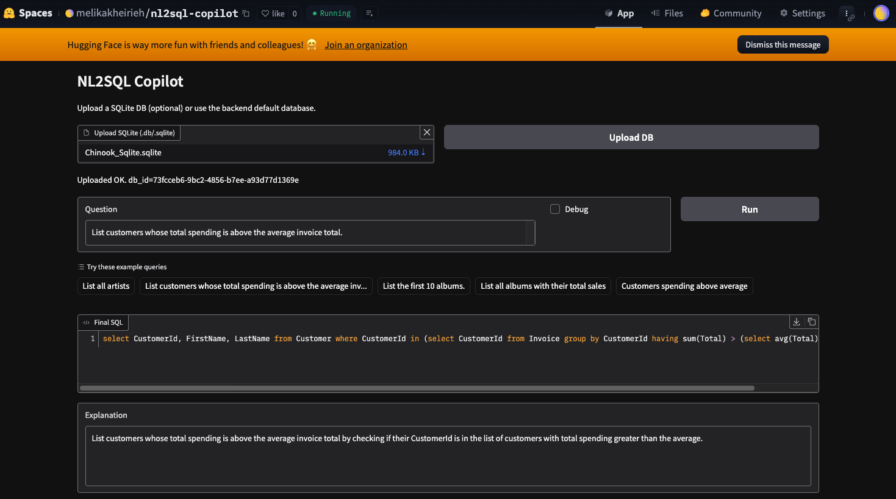
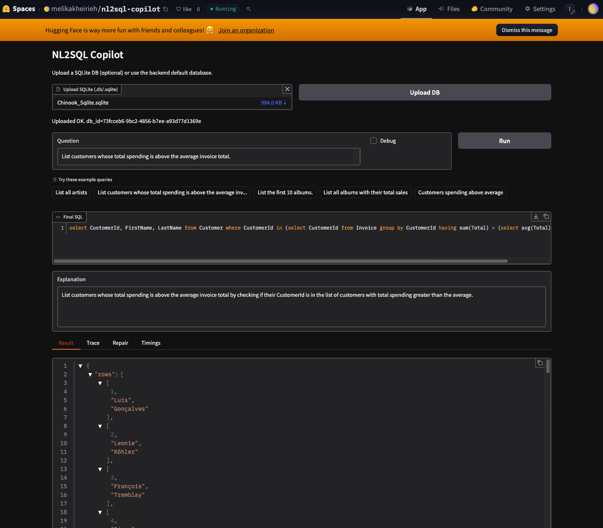
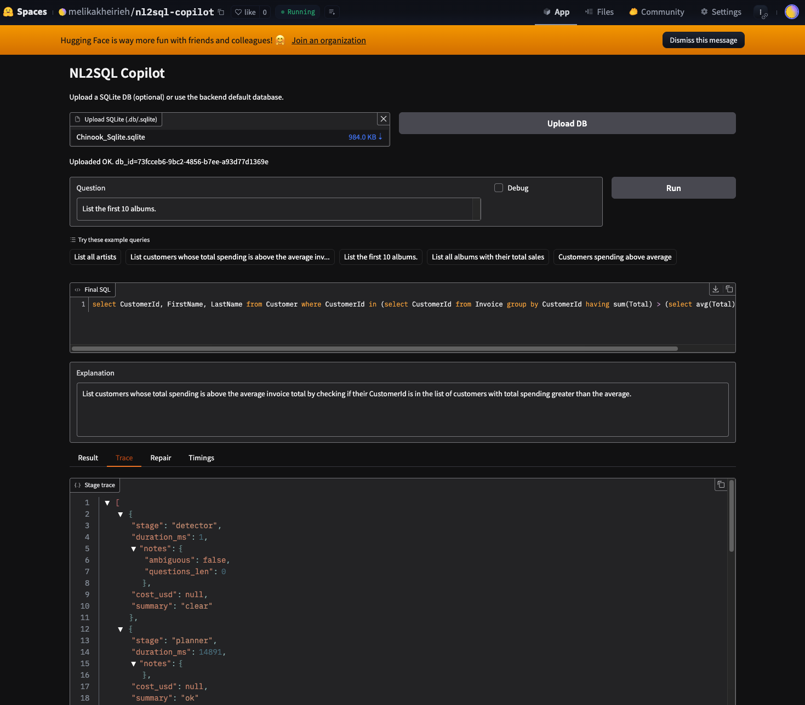
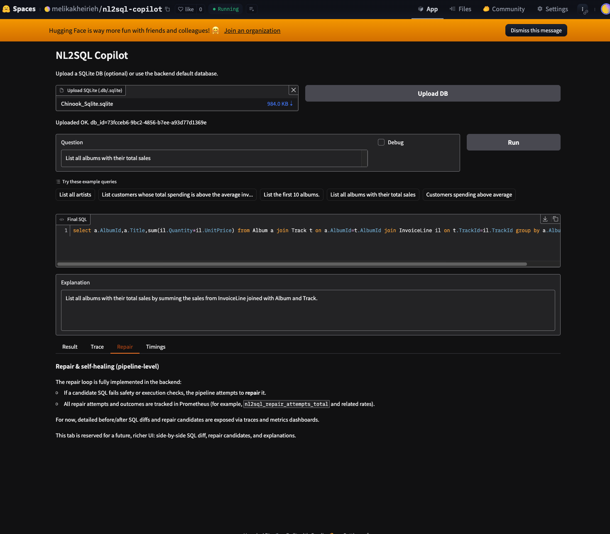
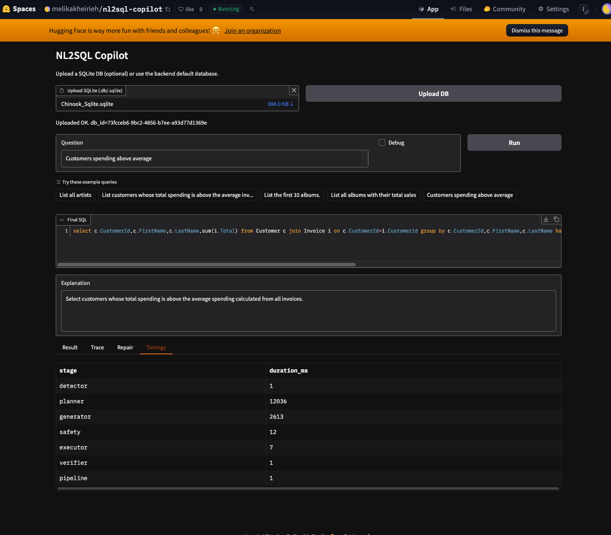

# UI Walkthrough — Hugging Face Demo

This document provides a focused walkthrough of the NL2SQL Copilot UI,
showing how different inspection views expose the behavior of the pipeline.

The screenshots below are taken from the live Hugging Face deployment.

---

## Minimal End-to-End Demo

**Purpose**
Demonstrates the full NL → SQL → Result flow in a minimal, readable form.

**What to notice**
- Natural-language query is translated into executable SQL.
- The generated SQL is shown explicitly (not hidden).
- Results are returned as structured rows, not free text.

This view is intentionally minimal and is used as the main screenshot in the README.

---

## Result View

**Purpose**
Shows the final, verified execution result of the generated SQL.

**What to notice**
- Results correspond to the *verified* SQL, not intermediate candidates.
- Output is deterministic and schema-aware.
- Errors and empty results are surfaced explicitly (not silently ignored).

---

## Trace View

**Purpose**
Exposes the internal, stage-by-stage execution trace of the pipeline.

**What to notice**
- Each pipeline stage reports structured metadata (duration, summary, notes).
- Ambiguity detection and planner decisions are visible.
- The same trace data is also exported as structured telemetry.

This view exists to make reasoning and debugging explicit rather than implicit.

---

## Repair View

**Purpose**
Documents the self-healing (repair) behavior of the pipeline.

**What to notice**
- Repair is a first-class pipeline concept, not an afterthought.
- Failed safety or execution checks can trigger repair attempts.
- Repair attempts and outcomes are tracked even when no repair is needed.

The UI currently shows an explanatory placeholder; richer before/after diffs
and candidate comparisons are planned.

---

## Timings View

**Purpose**
Shows latency breakdown across pipeline stages.

**What to notice**
- End-to-end latency is decomposed into detector, planner, generator, safety,
  executor, and verifier stages.
- Useful for performance analysis and SLO-style reasoning.
- Makes it clear where time is actually spent (LLM vs orchestration).

---

## Notes

- The Hugging Face UI is used as a deployment surface, not as a core dependency.
- All views reflect real executions from the deployed system.
- The UI is designed primarily as an inspection and debugging surface,
  not as a polished end-user product.
